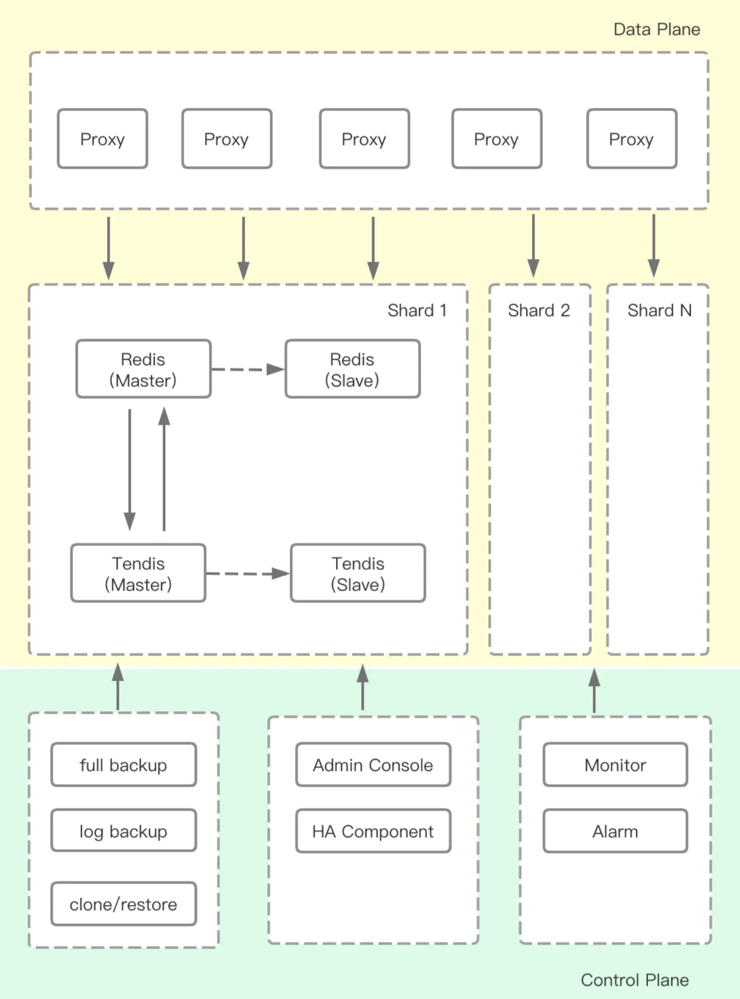
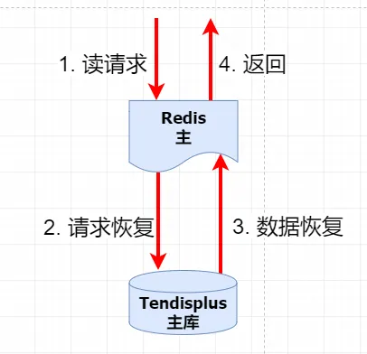
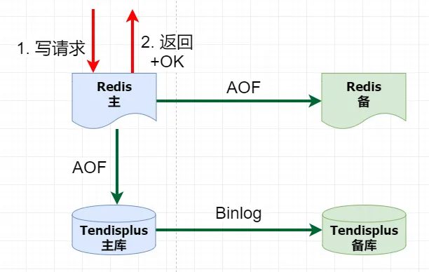
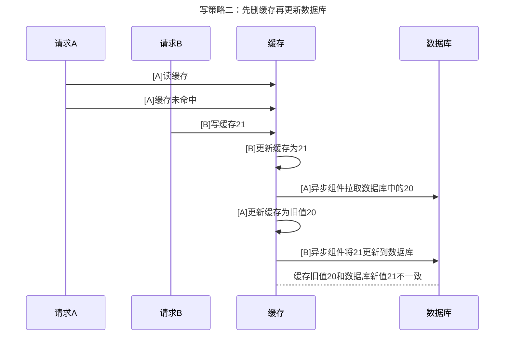

Tendis冷热混合存储方案

# 技术实现原理

1. 采用异步写回方案同步redis中的数据到后端tendisPlus（基于rocksdb）组件。通过订阅redis的aof日志将数据通过kafka异步写到后端tendisPlus
2. 缓存中保存全量key，数据淘汰到tendisPlus仅仅驱逐value，key还在reidis中。当某个key过期时，redis中触发淘汰，会在aof日志中有一条del记录，通过这条记录删除tendisPlus中的值。设置value-eviction-time值为7，表示7天未访问，会被驱逐到tendisPlus中。

## 读数据

1. 从 Redis 读取数据 。
2. 如果命中，那么就将数据返回给应用程序。
3. 如果redis中key不存在，则返回数据不存在
4. 如果未命中(key存在但数据已落地)，阻塞当前客户端， Redis 负责将 Key 从 Tendisplus 中恢复，然后返回给用户。

## 写数据

1. 写入 Redis 缓存，成功后返回。
2. 后台异步回刷，将数据持久化到后端 Tendisplus。
3. 监听写入速度，和redis落地和redis差距很大，则阻塞写

## 潜在常见问题
### 1. 缓存与数据库数据一致性

**解决办法：**
如果需要从 Tendisplus 中恢复数据，则请求 A 和 B 都阻塞。当数据恢复后，再唤醒阻塞的请求 A 和 B， 缓存和后端 Tendisplus 最终是一致的。
如果不需要从 Tendisplus 中恢复数据，则请求 A 和 B 肯定是顺序执行的，不会出现不一致的行为。

### 2. 缓存穿透
key redis不存在，不存在的key全部请求到db。由于redis保存全量key，不存在则返回不存在了，不会请求到redis
### 3. 缓存击穿
热key过期，大量请求落到db
如一致性的解决，当某个key缓存不存在，则会阻塞所有这个key的请求，等从tendisplus中恢复才会继续处理这些请求。

### 4. 缓存雪崩
缓存雪崩是指某一时刻发生大规模的缓存失效的情况，比如缓存故障或者缓存采用相同的过期时间，缓存在某一时刻同时失效， 请求全部转发给数据库。 TendisX 可以利用 Redis 集群模式实现高可用，即使缓存故障，也可以及时通过备缓存恢复服务。另外 TendisX 的用户请求统一由缓存服务，请求不会转发给后端数据库