 Markdown工具和资料参考


# 工具


|        | 支持平台    | 地址             | 优缺点                       |

| ------------- | -------------- | ---------------------------- | -------------------------------------------------- |

| Typora    | win,mac,linux | https://typora.io/#download | ****开源免费，跨平台，首选**** |

| VSCode   | win,mac,linux | 插件：Markdown Preview Mermaid Support | 左边编辑右边预览，写长的时序图比较方便 |

| Markdown Plus | 浏览器     | <http://mdp.tylingsoft.com/> | web，左边编辑右边预览。但不支持alt包含3个分支   |

| TAPD | | http://tapd.oa.com/markdown_wikis/wiki_demo | 目前标签跟mermaid标准不一样，并且注释暂时不支持BR换行，预计1月底的版本都支持 |


# 资料


markdown的时序图、流程图、甘特图等的详解，看这里


https://mermaidjs.github.io/ 


 转换到TAPD


目前版本的TAPD支持流程图、时序图，但标签跟mermaid标准不同，需要替换一下。预计2020年1月底的TAPD新版，就跟mermaid标准一样。


mermaid

sequenceDiagram

替换成 seq


mermaid

graph

替换成 flow


<BR/> 替换成空，因为现版本的TAPD还不支持BR换行


 时序图demo


# 1.时序图--普通


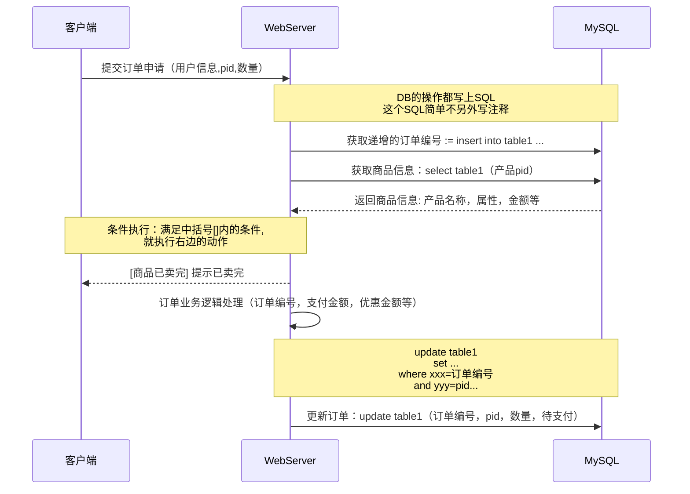


# 2.时序图--循环


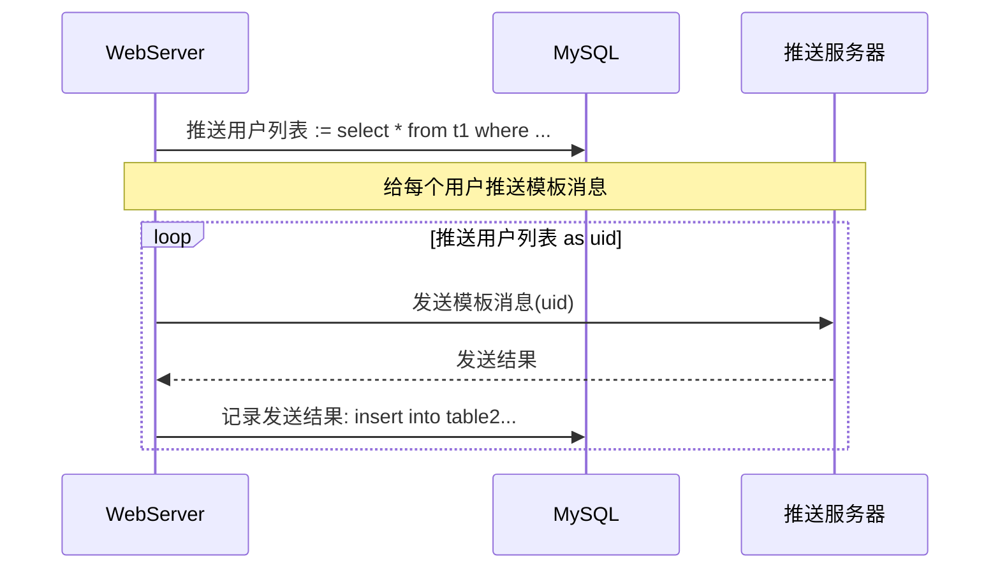


# 3.时序图--分支


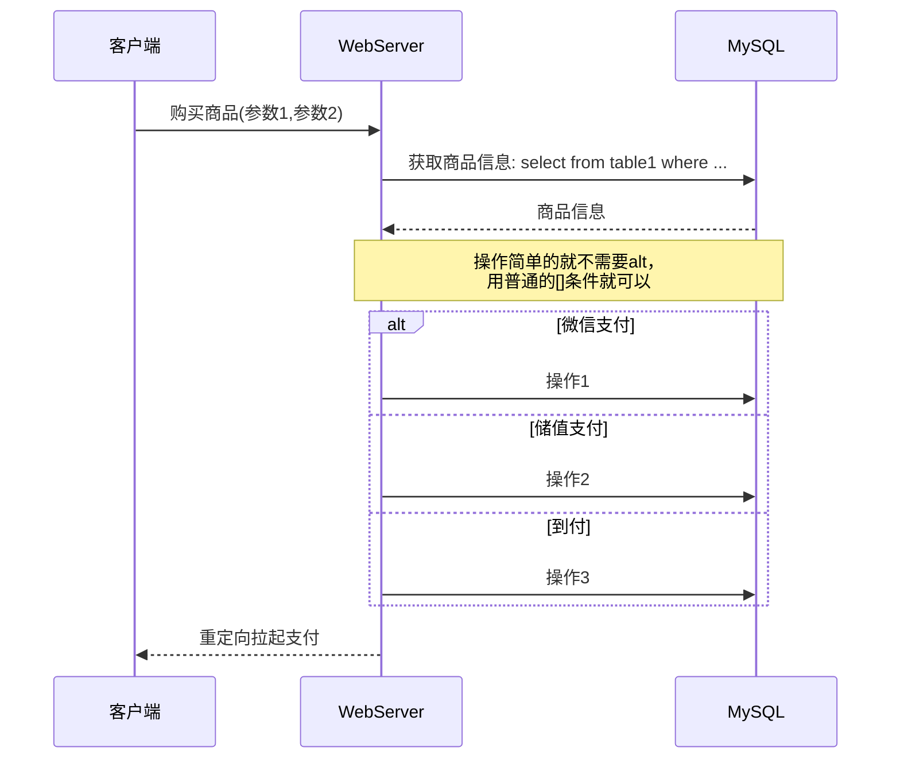


# 4.时序图--指定Actor的顺序


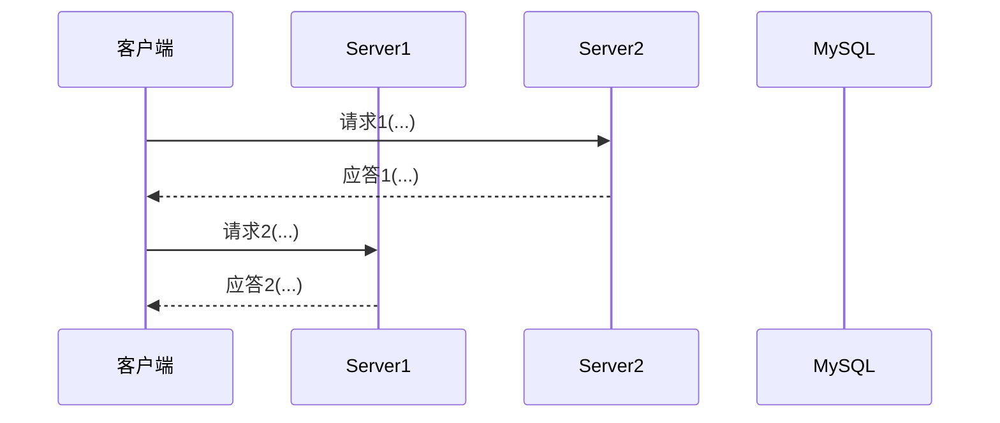


 流程图demo


# 流程图--从上到下


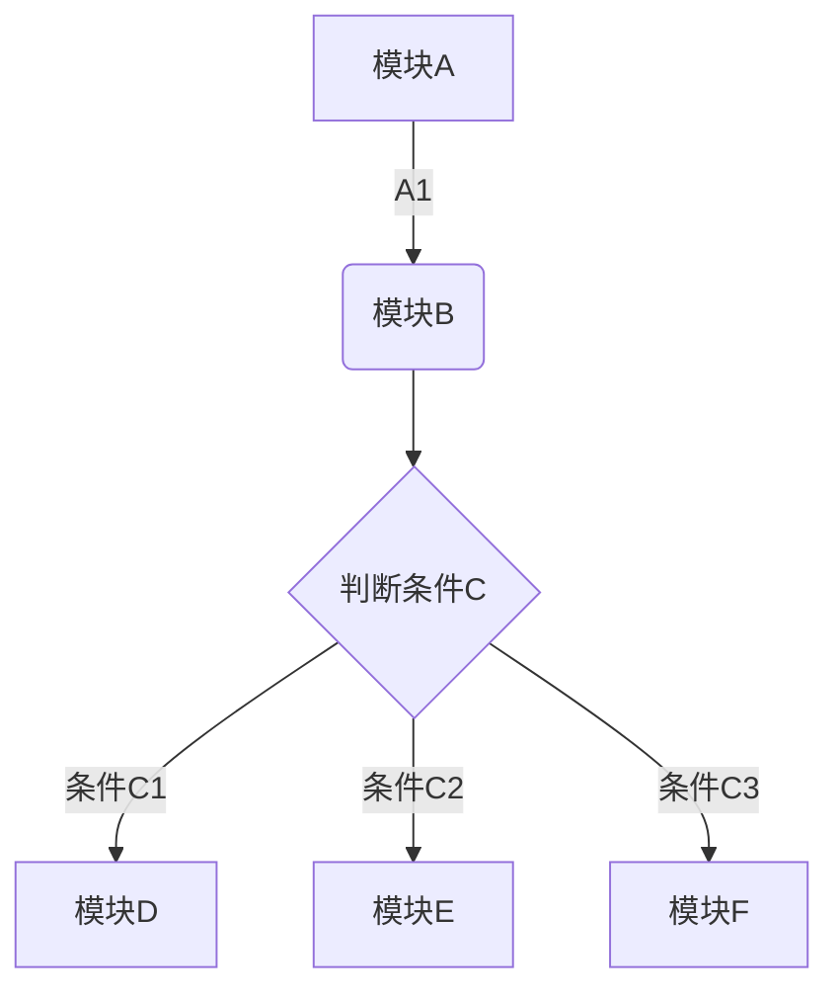


流程图--从左到右


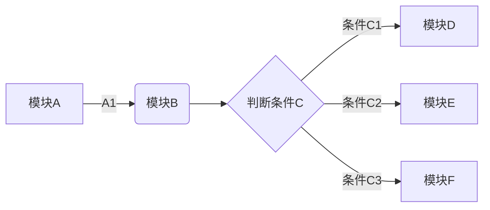


# 系统部署图


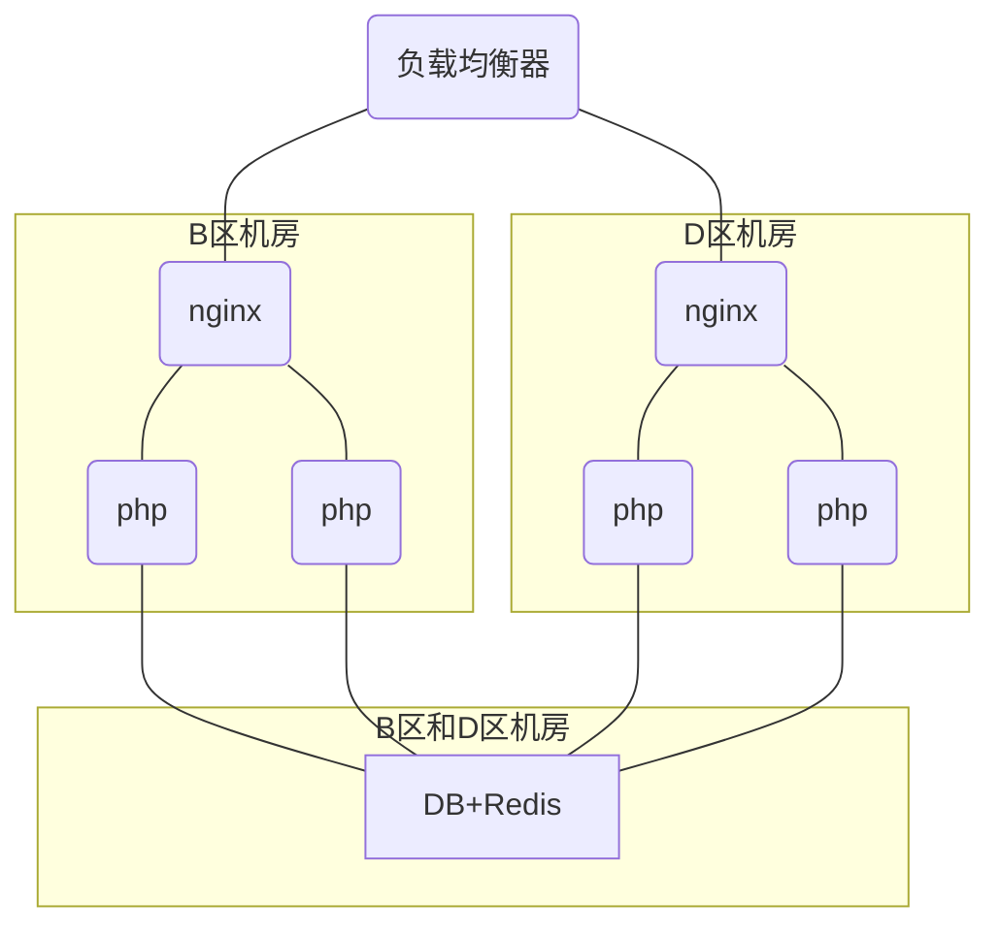


# 流程图变颜色和各种形状


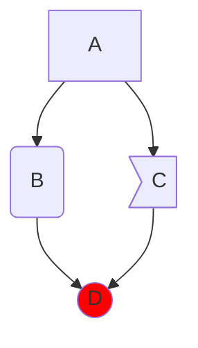


 状态机demo


# TCP状态机


```mermaid

stateDiagram

   

  note right of CLOSED: CLOSED是起点 

  CLOSED --> LISTEN: 被动打开

  CLOSED --> SYN_SENT: 主动打开发送SYN

  LISTEN --> CLOSED: 关闭

  LISTEN --> SYN_RCVD: 收到SYN,发送SYN,ACK

  LISTEN --> SYN_SENT: 发送SYN

  SYN_RCVD --> LISTEN: 收到RST

  SYN_RCVD --> ESTABLISHED: 收到ACK

  SYN_SENT --> SYN_RCVD: 收到SYN,发送SYN,ACK

  ESTABLISHED --> CLOSEWAIT: 收到FIN,发送ACK

   

  CLOSEWAIT --> LAST_ACK: 关闭 发送FIN

  LAST_ACK --> CLOSED: 收到ACK

   

  SYN_RCVD --> FIN_WAIT_1: 关闭 发送FIN

  ESTABLISHED --> FIN_WAIT_1: 关闭 发送FIN

  FIN_WAIT_1 --> FIN_WAIT_2: 收到ACK

  FIN_WAIT_1 --> CLOSING: 收到FIN,发送ACK

  FIN_WAIT_1 --> TIME_WAIT: 收到FIN,发送ACK

  FIN_WAIT_2 --> TIME_WAIT: 收到FIN,发送ACK

  CLOSING --> TIME_WAIT: 收到ACK

  TIME_WAIT --> CLOSED: 定时经过两倍报文段寿命后

   

```


# demo状态机


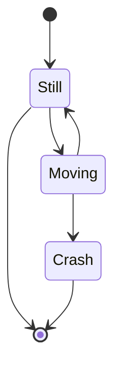


 类图


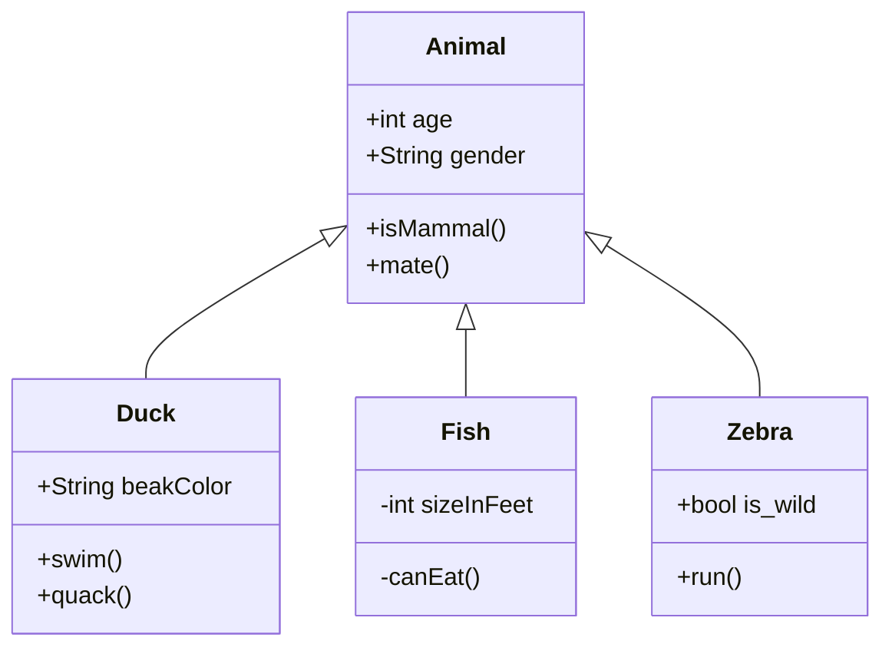


 饼图

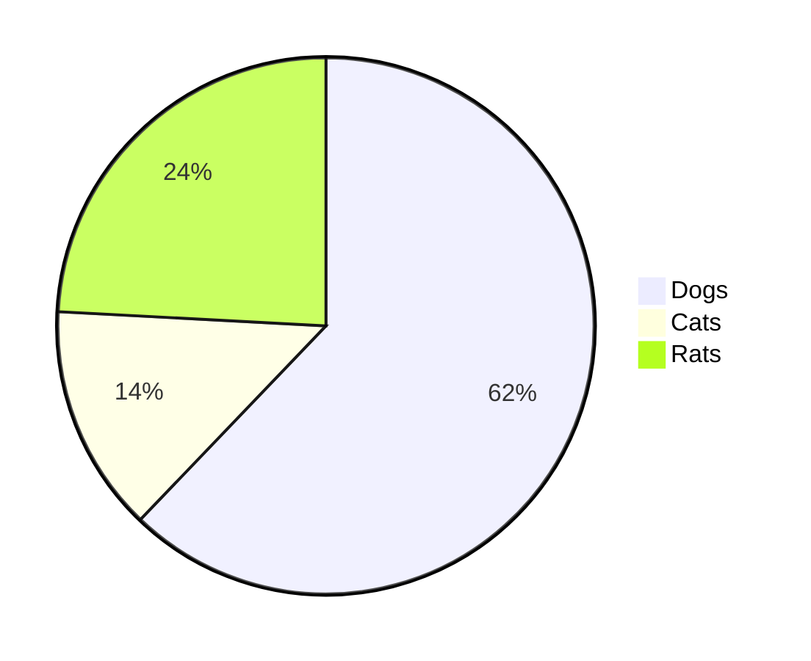


```

this is a python

```