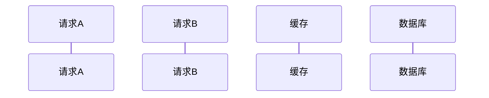

[toc]

# 一、缓存常见问题
1. 缓存与数据库数据一致性
2. 缓存雪崩
3. 缓存击穿
4. 缓存穿透

# 二、缓存一致性问题
要看我们对一致性的要求是否有那么高。考虑的是缓存和数据库是否一致，和读后写导致导致的多key并发一致性不是一个问题。

## 2.1 根据缓存更新策略，可以分为以下三类
1. 旁路缓存(cache aside)
2. 写穿(write/read through)
3. 异步写回(write behind / write back)

### 2.2 旁路缓存(cache aside)
**旁路缓存是开发中最常用的缓存使用策略**，这个策略是以数据库中的数据为主，缓存只是按需从数据库中加载。该策略缓存中的数据只读，不作修改操作（当数据有修改，也仅仅删除缓存中的数据），因此也称**只读模式**
读写策略如下：
读策略：
1. 读缓存，
2. 缓存中存在数据，直接返回
3. 缓存中不存在该数据，从数据库中查询
4. 将查询到的数据写回缓存，并返回给用户

写策略一（**常用**）：
1. 更新数据库中的数据
2. 删除缓存中的数据

写策略二：
1. 删除缓存中的数据
2. 更新数据库中的数据
3. 延时之后再删除缓存中的数据

使用旁路缓存写入数据时，由于写策略分为两步，故无法保证原子性，其中便可能导致数据的不一致

### 2.3 写穿(write through)
该策略的核心是用户仅操作缓存，不直接操作数据库。数据库仅由缓存组件来操作。同时，该方案是同步操作缓存和数据库，即写请求在写完缓存之后，需要缓存组件同步写回数据库，故也称为**同步直写**

读策略：
1. 读缓存
2. 缓存中存在数据，直接返回
3. 缓存中不存在该数据，从数据库中查询
4. 将查询到的数据写回缓存，并返回给用户

写操作：
1. 先查询要写入的数据是否存在
2. 当数据已经存在，更新缓存，缓存组件同步更新到数据库
3. 当数据不存在，方案一：write allocate 写入缓存，缓存组件同步更新到数据库。方案二：no write allocate 仅写入数据库（**更常用，可加速写**）

### 2.4 异步写回(write behind)
该方案和write through相比，用户写缓存后，不直接操作数据库，而是异步更新数据库。

