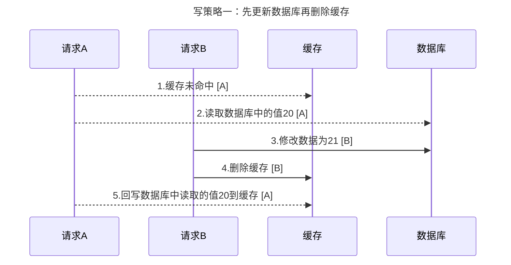
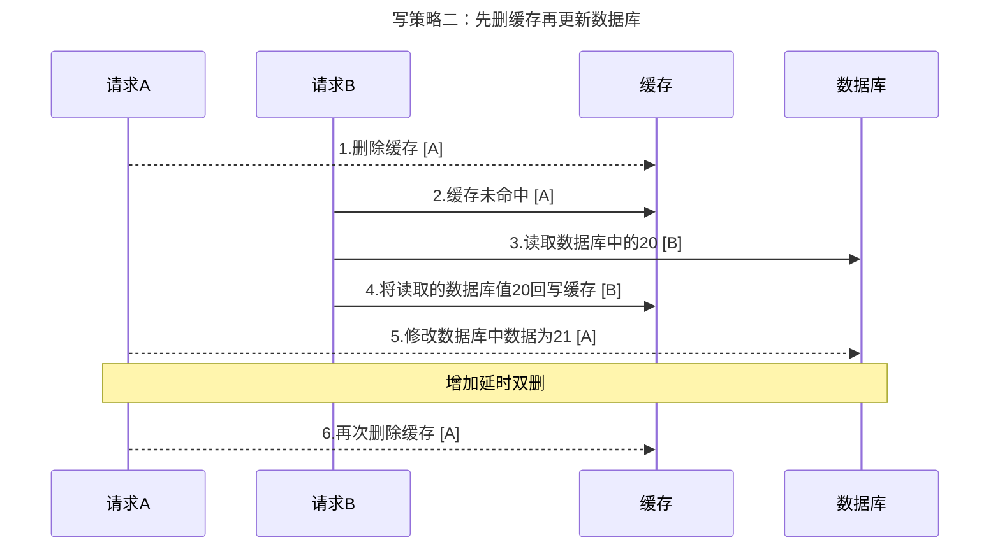
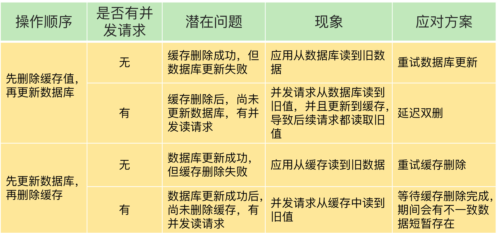
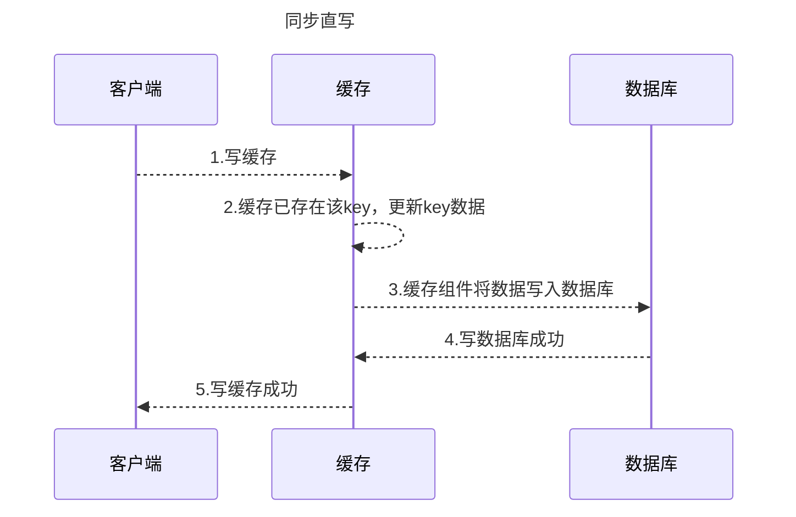

[toc]

# 一、缓存常见问题
1. 缓存与数据库数据一致性
2. 缓存雪崩
3. 缓存击穿
4. 缓存穿透

# 二、缓存一致性问题
缓存一致性问题的产生主要是因为请求需要事务地处理缓存和数据库。但实际操作中，难以保证事务性。
1. 操作隔离性：并发请求时，无法保证多个请求在处理缓存和处理数据库两个步骤上的时序。
2. 操作原子性：即使单个请求，也无法保证处理缓存和处理数据库的原子性，可能存在某个操作失败的情况

## 2.1 缓存更新策略
根据缓存更新策略，可以分为以下三类
1. 旁路缓存(cache aside)
2. 写穿(write/read through)
3. 异步写回(write behind / write back)
接下来根据不同的更新策略来分析产生一致性问题的原因和解决办法

## 2.2 旁路缓存(cache aside)
**旁路缓存是开发中最常用的缓存使用策略**，这个策略是以数据库中的数据为主，缓存只是按需从数据库中加载。该策略缓存中的数据只读，不作修改操作（当数据有修改，也仅仅删除缓存中的数据），因此也称**只读模式**
读写策略如下：
读策略：
1. 读缓存，
2. 缓存中存在数据，直接返回
3. 缓存中不存在该数据，从数据库中查询
4. 将查询到的数据写回缓存，并返回给用户

写策略一（**常用**）：
1. 更新数据库中的数据
2. 删除缓存中的数据

写策略二：
1. 删除缓存中的数据
2. 更新数据库中的数据
3. 延时之后再删除缓存中的数据

使用旁路缓存策略，数据库中的数据是最终版本，当缓存崩溃或者缓存中的数据被淘汰后，有读请求时数据将从数据库中加载到缓存，继续加速读请求。然而，由于写策略分为两步，故无法保证原子性，其中便可能导致数据的不一致

该读写顺序将会导致数据长期不一致，然而，该情况发生的概率很低，A读取数据库之后，B请求需要写数据库，A需要写缓存，而写缓存数据远远快于写数据库，所以正常情况下，第5步都会快于第3步完成，所以删除缓存应该会再最后执行
以上展示的是数据一开始不存在缓存时会导致的数据不一致。当数据一开始就存在缓存中，那么就会导致B写请求已经修改了数据库了，但是A读请求仍然读到旧数据，会导致短暂的数据不一致。要解决这个办法，只有先删除缓存，如策略二，防止脏读。
虽然该策略存在一定的问题，但是由于实现简单，便于落地，大部分场景均使用本策略

先删除缓存后更新数据库，由于修改数据库耗时更长，所以很可能出现2，3先执行。导致数据库中的数据长期不一致。该方案的解决办法是延时双删，但最后一次删除的时间比较难控制

该策略不会有脏读的问题，只是难以评估延时删除的时延，通常需要大于B请求读取数据库+写入缓存的时间

**除此之外，导致不一致的情况还可能是数据库和缓存操作中有一个失败：**

## 2.3 写穿(write through)
该策略的核心是用户仅操作缓存，不直接操作数据库。数据库仅由缓存组件来操作。同时，该方案是同步操作缓存和数据库，即写请求在写完缓存之后，需要缓存组件同步写回数据库，故也称为**同步直写**

读策略：
1. 读缓存
2. 缓存中存在数据，直接返回
3. 缓存中不存在该数据，从数据库中查询
4. 将查询到的数据写回缓存，并返回给用户

写操作：
1. 先查询要写入的数据是否存在缓存中
2. 当数据已经存在，更新缓存，缓存组件同步更新到数据库，数据库更新成功才返回给用户
3. 当数据不存在，方案一：write allocate 写入缓存，缓存组件同步更新到数据库。方案二：no write allocate 仅写入数据库（**更常用，可加速写**）

同步直写在写缓存之后，需要同步写入数据库，所以即使是缓存宕机，数据也不会丢失，不过，该操作会降低写请求的响应速度，增加了缓存的响应延迟。
上述方案建立在缓存组件有挂载后端数据库，而不是通过proxy代理方式来操作，proxy代理方案就要考虑网络，写操作之前先查询是否在缓存中耗时更大，故proxy方式更时候write allocate，省去查询缓存，直接写缓存

## 2.4 异步写回(write behind)
该方案和write through相比，用户写缓存后，不直接操作数据库，而是异步更新数据库。
先将数据写入到缓存，然后插入到操作队列中，定期flush到数据库

该方案优先考虑了响应延迟，针对写请求也有加速，适用于写频繁的场景。然而异步操作会导致数据库和缓存存在一定的时延，当缓存崩溃，数据还没来得及从操作队列刷新到数据库，则会有数据丢失的风险。

# 三、缓存雪崩、击穿、穿透问题
## 3.1 缓存雪崩
缓存层无法处理请求，导致请求都落到数据库层
1. 缓存中有大量数据过期，导致缓存无法处理请求
    解决办法：a：过期时间增加随机数，打散key的淘汰时间 b：服务降级，核心数据继续访问，非核心数据直接返回空
2. 缓存服务期宕机，导致缓存无法处理请求
    解决办法：a：服务熔断 b：服务限流
## 3.2 缓存击穿
某个访问非常频繁的热点数据，无法在缓存中处理，导致该数据的大量请求，一下子发送到了数据库
1. 热点数据过期
    解决办法：热点数据不设置过期
## 3.3 缓存穿透
要访问的数据既不在缓存中，也不在数据库中。导致请求缓存时，发生缓存缺失，再去访问数据库，数据库也没有数据。当产生大量的这种请求时，缓存便成了摆设，会给数据库带来巨大压力
解决办法：
1. 回种空值
    当从数据库查询到的数据为空时，我们可以往缓存中插入一个空值，如用-1表示，并设置较短的过期时间，让空值能够短时间内淘汰。
    该方案能处理某个key一直查不到的问题。但是当大量key都查不到，将会在缓存中回种大量无效的key，只是就需要使用布隆过滤器来处理该问题
2. 使用布隆过滤器
    将存量数据和新增数据都写到布隆过滤器中，当有写请求，先写数据库，然后写到布隆过滤器中。有请求到达时，先查询布隆过滤器，当布隆过滤器为1，表示有数据，允许访问；否则认为数据不存在，直接拒绝访问。
    布隆过滤器只能判断一个元素一定不存在和可能存在两种情况。当某个key查询布隆过滤器返回1时，表示该元素可能存在，允许访问，所以会有部分false positive（假阳性）到达数据库。同时，当数据库中删除数据之后，布隆过滤器无法更新，导致这一部分请求仍然会落到数据库上。